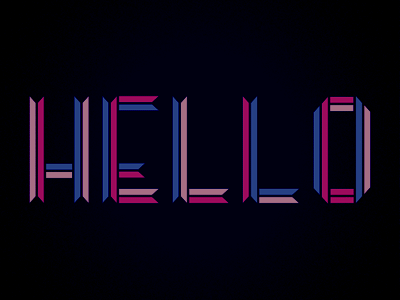

  

<h1 align='center'>Hello Everyone! Bem vindos 👋👋</h1>

<h3 align='center'>🔭 About me 🔭</h3>

Me chamo Gustavo Barreto, tenho 25 anos e sou apaixonado pelo mundo do desenvolvimento. Já trabalho com tecnologia da informação há algum tempo, contudo, sempre na área de infra-estrutura de TI (mais especificamente com servidores Linux).    Tenho investido tempo e esforços para atuar no mercado de Desenvolvimento de software pois é algo que me fascina desde a época da graduação, onde tive meu primeiro contato com programação. Me formei em Engenharia de Telecomunicações e fiz mestrado em Ciência da Computação.

<h3 align='center'>🌱 Tecnologies 🌱</h3>

Quase todo meus estudos e trabalhos são direcionados para o desenvolvimento web, focando na <b>Stack JavaScript</b>. Aqui está uma lista resumido a cerca das tecnologias aplicadas em meus projetos:   

<ol>
  <li>HTML/CSS/JS</li>
  <li>Frameworks de estilização cono <b>TailWind</b>, <b>Bootstrap</b> e <b>Bulma</b>. Além de estruturar css com <b>SASS</b></li>
  <li>Frameworks JS como <b>ReactJS</b>, <b>NextJS</b> e <b>VueJS</b>.</li>
</ol> 
<!--
**barretou/barretou** is a ✨ _special_ ✨ repository because its `README.md` (this file) appears on your GitHub profile.

Here are some ideas to get you started:

-  🤔I’m currently working on ...
-  I’m currently learning ...
- 👯 I’m looking to collaborate on ...
-  I’m looking for help with ...
- 💬 Ask me about ...
- 📫 How to reach me: ...
-  Pronouns: ...
- ⚡ Fun fact: ...
-->
